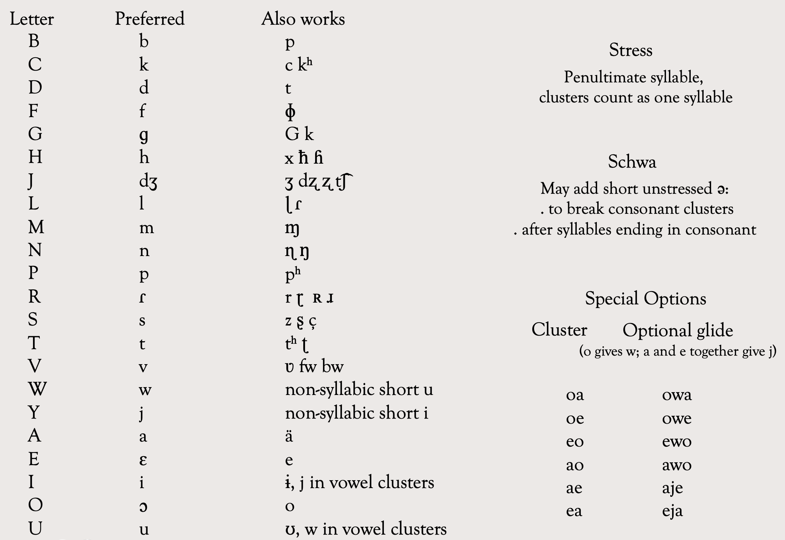

# Pronunciation Guide

## Consonants

<audio controls style="width:100%">
  <source src="/course_warmups/audio/consonants.mp3" type="audio/mpeg">
</audio>


**B C D F G H J L M N P R S T V W Y**

All pronounced as expected in American English, with these specific values:

| Letter | IPA | Sounds like |
|---|---|---|
| c | /k/ | cake (Oravia has no letter k) |
| h | /h/, /ʁ/, or /x/ | variable, from English h to a soft rasp |
| j | /dʒ/ | jello |
| r | /ɾ/ | the tt in butter, like a flap |
| y | /j/ | the y in yes |

## Vowels

<audio controls style="width:100%">
  <source src="/course_warmups/audio/vowels.mp3" type="audio/mpeg">
</audio>

**Vowels: A E I O U**

- **A** /ɑ/ as in *father* 
- **E** /ɛ/ as in  *cellar* 
- **I** /i/ as in *creek* 
- **O** /ɔ/ as in *door*
- **U** /u/ as in *flu*

If you pronounce E and O closed like in Spanish (IPA e and o), that's fine too!

## Stress

Stress always falls on the penultimate syllable (second to last). The exception is when you have a suffix, which gets a secondary stress.

```
coupa    → COU-pa
eledora  → e-le-DO-ra
lidastor → li-DAS-tor
mouje → MOU-je
moujeum (mouje+um) → MOU-je-UM
```

Adjacent vowels are preferably pronounced as one syllable, as in o**RA**via, but as a hiatus is also acceptable. This does not change the syllable count for stress. 

**LI**.ria — preferred  
**LI**.ri.a — also acceptable


## Vowel Clusters

Vowel clusters may be pronounced as diphthong (same syllable), hiatus (separately), or stop.  
If you have trouble pronouncing vowel clusters, you can also use glides. Take a look: 

```
i -> /j/
u -> w
o -> gives w
a and e together -> give /j/
```

For example, this is the alternative glide pronunciation:
```
ia -> ja
uo -> wo
oa -> owa
oe -> owe
eo -> ewo
ao -> awo
ae -> aje
ea -> eja
```


## Consonant Clusters

If you have trouble with the pronunciation of consonant clusters, you may add a short unstressed schwa 'ə' between them: yahluls -> yahlul(ə)s. As with vowel clusters, this does not change the syllable count for stress:

**YAH**.luls   
**YAH**.lu.ləs

## Accommodations

Oravia leaves unusual room for different accents. It was designed to avoid similar sounding words and to accomodate pronunciation diversity. So, beyond the cluster accommodations, if you have trouble with any of the sounds, you may use an approximation:   

{ width="720" style="display:block; margin:1.25rem auto 2rem auto;" }
