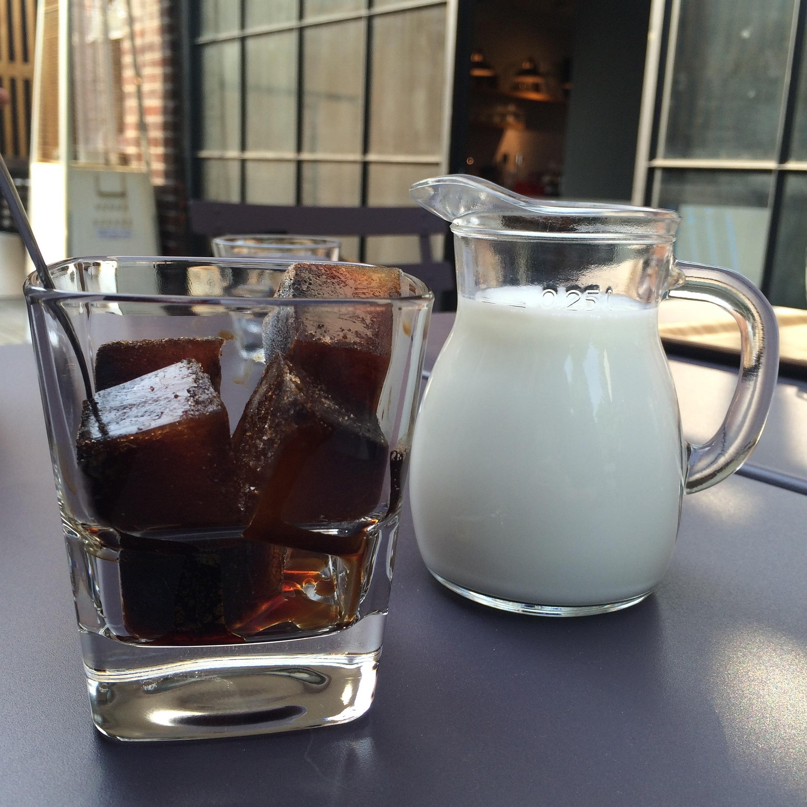

# 1.3 — Milk or Coffee?

[← All graded readers](reader.md)

<!-- PICTURE TO ADD: Two partners at a table, one with coffee and one with milk. -->

{ width="480" style="display:block; margin:1.25rem auto 2rem auto;" }

Nim faibor i ilaluan: “I anidai e moulu dou e mogali?”

Nim i ilaluan: “Mogali.”

Hay i anona e mogali u nim.

Hay i mouje e moulu.

Nim i dapas e mogali.

Show English translation

My partner says, “Do you want milk or coffee?”

I say, “Coffee.”

They give me coffee.

They drink milk.

I like the coffee.

**Try to answer in Oravia:** What does each person drink?

---

[← 1.2 Money for a Parent](reader1-02-money-for-a-parent.md) · [All graded readers](reader.md) · [1.4 Where Is the Bathroom? →](reader1-04-where-is-the-bathroom.md)
