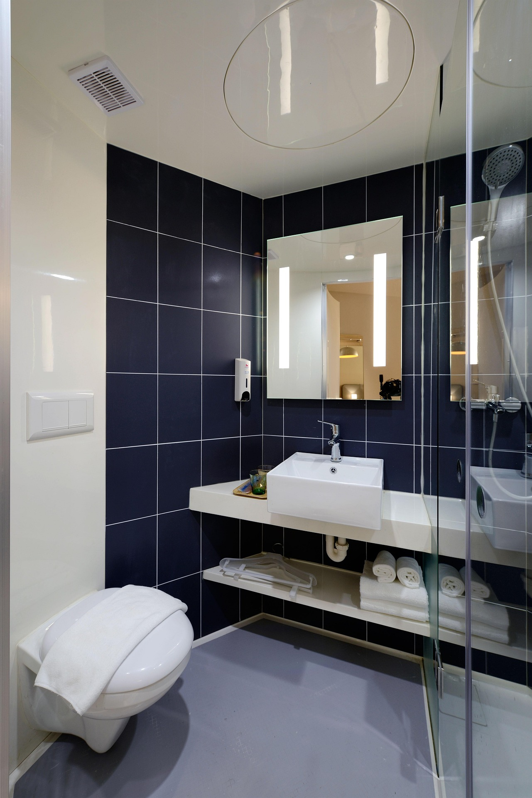

# 1.4 — Where Is the Bathroom?

[← All graded readers](reader.md)

<!-- PICTURE TO ADD: A woman pointing toward a small room where the bathroom is located. -->

{ width="480" style="display:block; margin:1.25rem auto 2rem auto;" }

Nim i ilaluan u faejor: “Cedom a bosvi?”

Faejor i ilaluan: “En yalgai boelori.”

A nim en yalgai boelori.

A bosvi en boelori.

Nim i dapas e boelori.

Show English translation

I say to a woman, “Where is the bathroom?”

She says, “In the small room.”

I am in the small room.

The bathroom is in the room.

I like the room.

**Try to answer in Oravia:** Is the bathroom in a small room or a large room?

---

[← 1.3 Milk or Coffee?](reader1-03-milk-or-coffee.md) · [All graded readers](reader.md) · [1.5 Who Is Tall? →](reader1-05-who-is-tall.md)
