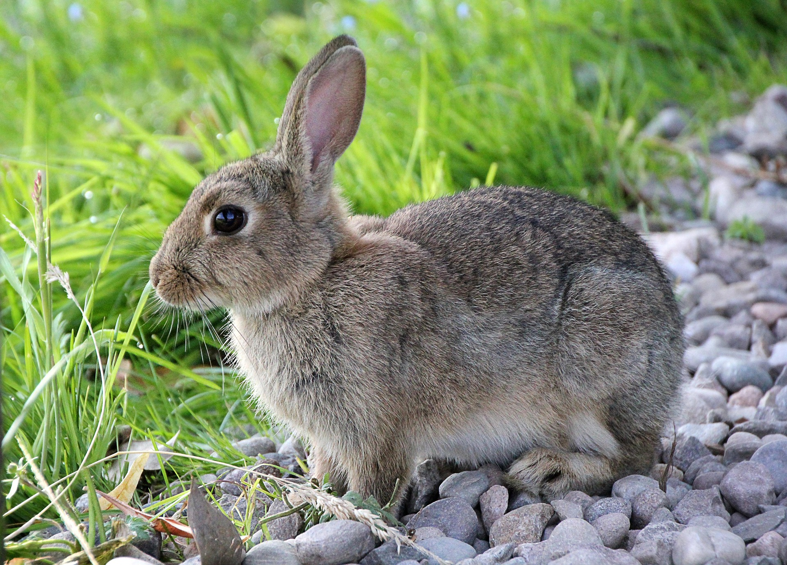

# 1.5 — The Rabbit

[← All graded readers](reader.md)

<!-- PICTURE TO ADD: A tall child and a shorter grandparent joking with each other. -->

{ width="480" style="display:block; margin:1.25rem auto 2rem auto;" }

A nim en lenou.

I dami a micea.

A nim i anidai i eofa e micea.

I anona e yaltan moaria u hay.

Mai hay i apasoi.

Show English translation

I am on the grass.

There is a rabbit.

I want to befriend the rabbit.”

I give a big apple to them.”

But they run away.

**Try to answer in Oravia:** What did the rabbit do?

---

[← 1.4 Where Is the Bathroom?](reader1-04-where-is-the-bathroom.md) · [All graded readers](reader.md) · [1.6 A Small Bowl →](reader1-06-a-small-bowl.md)
