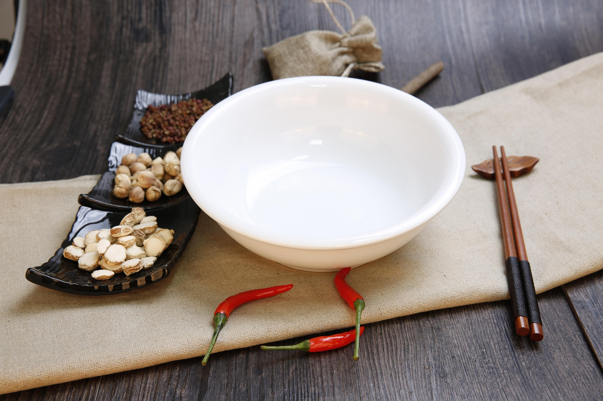

# 1.6 — A Small Bowl

[← All graded readers](reader.md)

<!-- PICTURE TO ADD: Someone buying a small bowl and giving it to a parent. -->

{ width="480" style="display:block; margin:1.25rem auto 2rem auto;" }

Nim fano i anifou e yalgai molcui.

Nim i gehna e yalgai molcui.

Nim i anona e molcui u nim fano.

Hay i dapas e molcui.

Show English translation

My kid needs a small bowl.

I buy a small bowl.

I give the bowl to my kid.

They like it.

**Try to answer in Oravia:** What does the speaker buy?

---

[← 1.5 Who Is Tall?](reader1-05-who-is-tall.md) · [All graded readers](reader.md) · [1.7 Seven or Eight? →](reader1-07-seven-or-eight.md)
