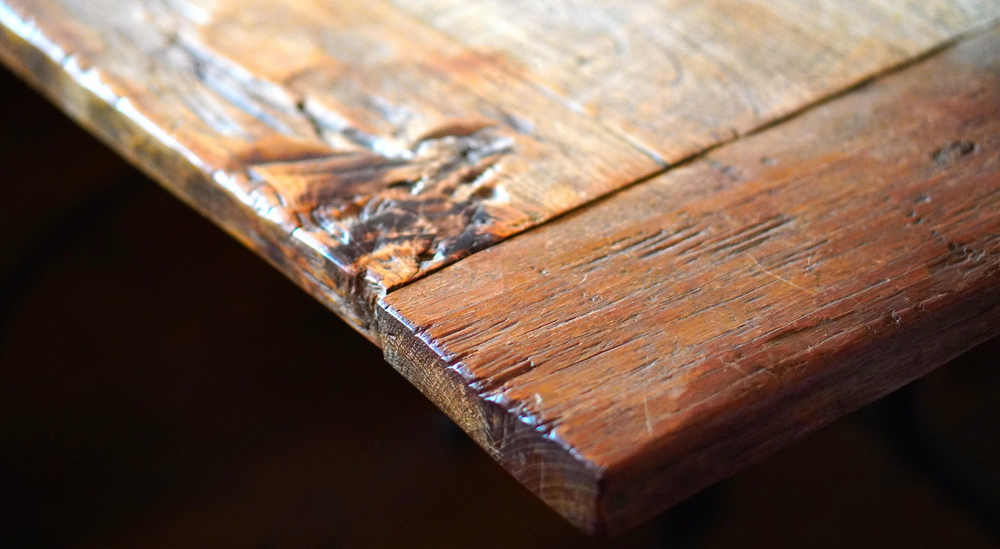

# 1.8 — The Old Table

[← All graded readers](reader.md)

<!-- PICTURE TO ADD: A parent and adult child talking beside an old table with sentimental value. -->

{ width="480" style="display:block; margin:1.25rem auto 2rem auto;" }

Litamar, nim i eodenbor e nim fare.

A bontame de nim fare a yamirli.

Nim i ilace: “Ceora run i dapas e yamirli bontame?”

Hay i ilaluan: “Caora a nim a yamirli su.”

Show English translation

Yesterday, I visited my parent.

My parent’s table is old.

I ask, “Why do you like the old table?”

They say, “Because I am old too.”

**Try to answer in Oravia:** Why does the parent like the table?

---

[← 1.7 Seven or Eight?](reader1-07-seven-or-eight.md) · [All graded readers](reader.md) · [1.9 One Table, Six People →](reader1-09-one-table-six-people.md)
