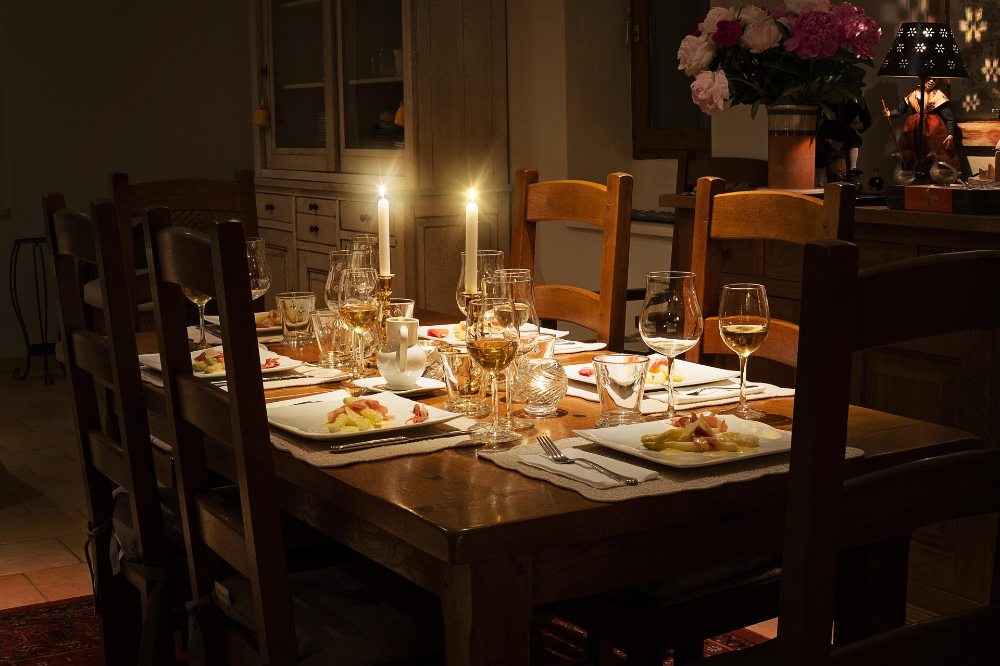

# 1.8 — One Table, Six People

[← All graded readers](reader.md)

<!-- PICTURE TO ADD: Six people arriving for a gathering where there is only one small table. -->

{ width="480" style="display:block; margin:1.25rem auto 2rem auto;" }

Nim su nim faibor i anye e eomsu en yaltan boelori.

I dami a tam bontame.

I dami a teva ilhei.

A bontame a yalgai.

Nimas i iliro ca i anifou e tor bontame.

Show English translation

My partner and I organize a gathering in a large room.

There is one table.

There are six people.

The table is small.

We think we need two tables.

**Try to answer in Oravia:** Why do they need another table?

---

[← 1.7 The Old Table](reader1-08-the-old-table.md) · [All graded readers](reader.md) · [1.9 The Wrong Room →](reader1-10-the-wrong-room.md)
