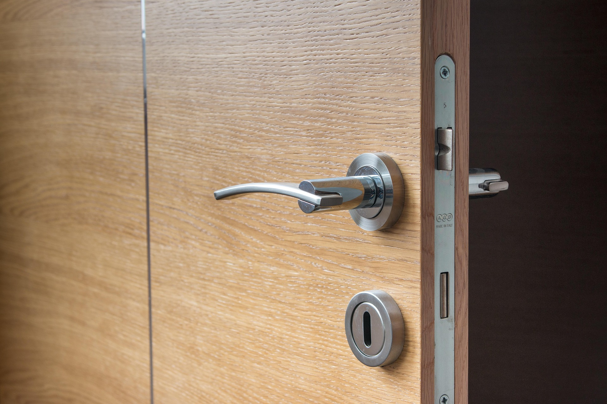

# 1.9 — The Wrong Room

[← All graded readers](reader.md)

<!-- PICTURE TO ADD: Someone leaving a large empty room and finding the gathering in a smaller room. -->

{ width="480" style="display:block; margin:1.25rem auto 2rem auto;" }

Nim i bortal en yaltan boelori.

Nim i ilace: “Cedom a eomsu?”

Faejor i ilaluan: “En yalgai boelori.”

Nim i bortal en yalgai boelori.

Nim i eodani e nim faibor.

Show English translation

I enter the large room.

I ask, “Where is the gathering?”

A woman says, “In the small room.”

I enter the small room and meet my partner.

**Try to answer in Oravia:** Which room has the gathering?

---

[← 1.8 One Table, Six People](reader1-09-one-table-six-people.md) · [All graded readers](reader.md) · [2.1 Returned Money  →](reader2-01-my-friend-already-paid.md)
