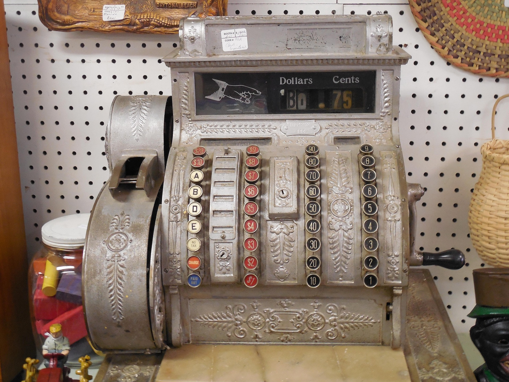

# 2.1 — Returned Money

[← All graded readers](reader.md)

<!-- IMAGE: Two friends buying food; the woman taking payment immediately gives the money back to one of them. -->

{ width="480" style="display:block; margin:1.25rem auto 2rem auto;" }

Nim su eofa i mo en bevio.

A nim i anona e gerina u faejor de bevio.

A faejor i anona e gerina u nim.

Lili a nim i anona u faejor, su lili a hay i anona u nim.

Eta nim i ilace: “Ceora?”

A faejor i ilaluan: “A run eofa i gerinar.”

Show English translation

My friend and I eat at a shop.

I give money to the woman of the shop.

She gives the money back to me.

Again I give the money to the woman, and again she gives it to me.

So I ask, “Why?”

The woman says, “Your friend has paid.”

---

## Try to answer in Oravia

<strong>Ceora a faejor i anona e gerina u nim?</strong>

Check answer

<strong>English question:</strong> Why does the woman give me the money?

<strong>Possible answer:</strong> A run eofa i gerinar.

<strong>English:</strong> Your friend has paid.

---

[← 1.9 The Wrong Room](reader1-10-the-wrong-room.md) · [All graded readers](reader.md) · [2.2 Meeting Someone →](reader2-02-the-small-party.md)
