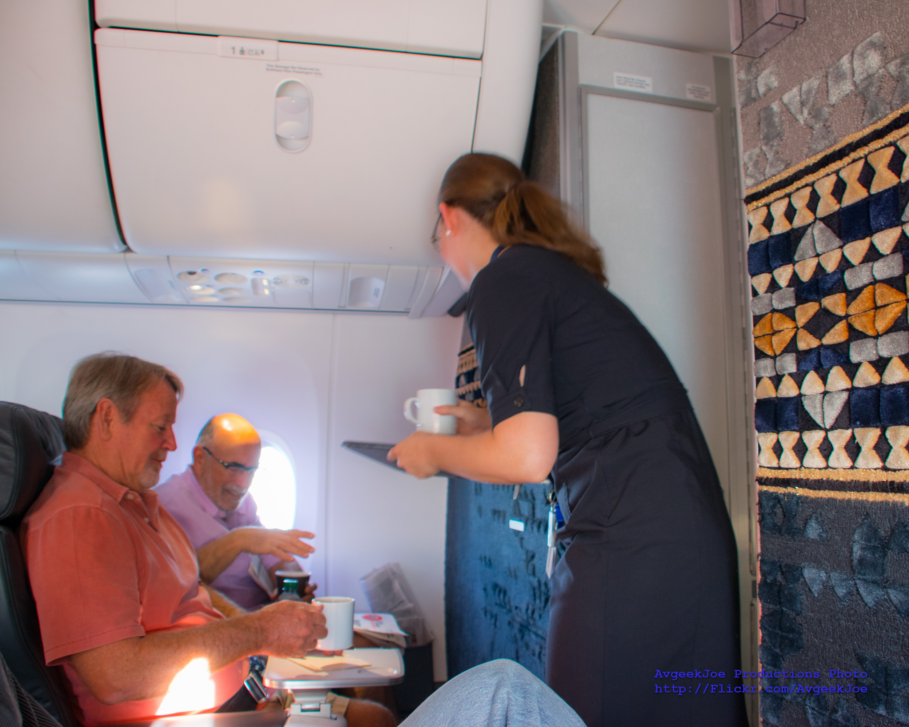

# 2.3 — On the Plane

[← All graded readers](reader.md)

{ width="480" style="display:block; margin:1.25rem auto 2rem auto;" }

"A run i anidai ce mouje? Moaria mouje dou mogali?"

"Mogali, eori."

"Moval mogali?"

"Um, mai su moulu, eori."

"Run i anidai e mocen su?”

"Ia, anidai. Nim fano en bosvi, eta a nim i do i anita e tor?"

"Nim i do i anona e tor mocen, u run su u hay."

"Eloan!"

Show English translation

"Which drink would you like? Apple juice or coffee?"

"Coffee, please."

"Cold coffee?"

"No, but with milk, please."

"Would you like chocolate too?”

"Yes, I do. My kid is in the bathroom, so can I take two?"

"I can give you two chocolates, for you and for them."

"Thank you!"

---

## Try to answer in Oravia

<strong>A faejor i anona e tor mocen ceora?</strong>

Check answer

<strong>English question:</strong> Why did the woman give two chocolate bars?

<strong>Possible answer:</strong> Caora tam mocen u faejal su tam u hay fano.

<strong>English:</strong> Because it's one chocolate for the man and one for his kid.

[← 2.2 The Small Party](reader2-02-the-small-party.md) · [All graded readers](reader.md) · [2.4 The Table and the Door →](reader2-04-the-table-and-the-door.md)
