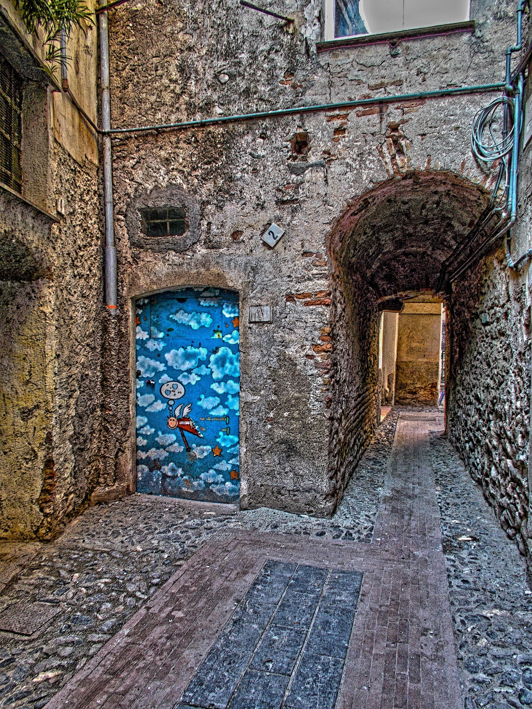

# 2.4 — The Table and the Door

[← All graded readers](reader.md)

<!-- IMAGE: A large table stopped at a very small doorway while a parent and child look at the problem. -->

{ width="480" style="display:block; margin:1.25rem auto 2rem auto;" }

A fare i gehna e yaltan bontame.

Yuba bontame.

Eta hay i anona u fano.

A fano i dapas e bontame.

A bontame a yaltan, mai a bortal de boelori a yalgai.

A fano i bortal en boelori.

A bontame i bortalum.

Show English translation

A parent buys a large table.

A nice table.

So they give it to their child.

The child likes the table.

The table is large, but the room’s door is small.

The child enters the room.

The table does not.

---
## Try to answer in Oravia

<strong>Ceora a fare i anona e bontame u fano?</strong>

Check answer

<strong>English question:</strong> Why did the parent give the table to the child?

<strong>Possible answer:</strong> Caora a bontame a yuba.

<strong>English:</strong> Because the table is good.

[← 2.3 Nobody Is Here](reader2-03-nobody-is-here.md) · [All graded readers](reader.md) · [2.5 One Empty Seat →](reader2-05-seat.md)
