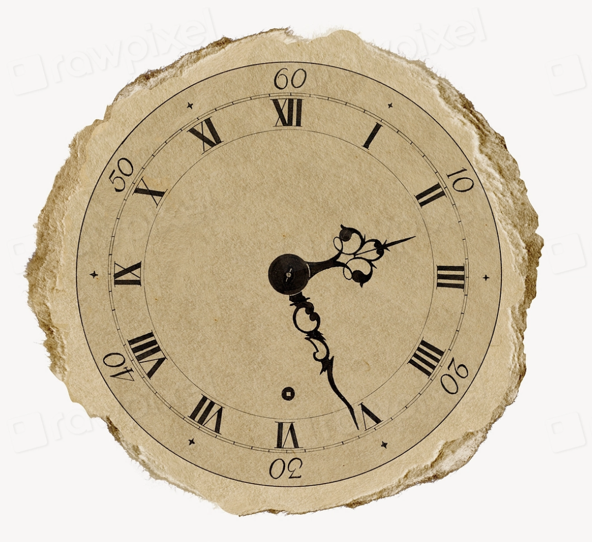

# 2.6 — Seven or Eight?

[← All graded readers](reader.md){ .graded-reader-back }

{ width="480" style="display:block; margin:1.25rem auto 2rem auto;" }

Nim i iliro ca a eomsu en peri litetan.

Nim faibor i ilaluan ca a eomsu en auta litetan.

Eta nimas i ilianum cali anvu.

I corior e eofa su i ilace:

"Eon! Run eomsu, en litam peri dou auta?"

A eofa i asunes su i ilaluan: "Tenda!"

Show English translation

I think the party is at seven o'clock.

My partner thinks that the party is at eight o'clock.

So we don't know when to go.

I call my friend and ask:

"Hello! Your party, is it at seven or eight today?”

My friend laughs and says: "Nine!"

**Try to answer in Oravia:** Celi a eomsu de eofa?

---

## Try to answer in Oravia

<strong>Celi a eomsu de eofa?</strong>

Check answer

<strong>English question:</strong> When is the friend's party?

<strong>Possible answer:</strong> A eomsu de eofa en tenda litetan.

<strong>English:</strong> The friend's party is at nine o'clock.

[2.5 — The Empty Seat](reader2-05-seat.md) · [All graded readers](reader.md) · [3.1 — The Birds](reader3-01-the-birds.md)