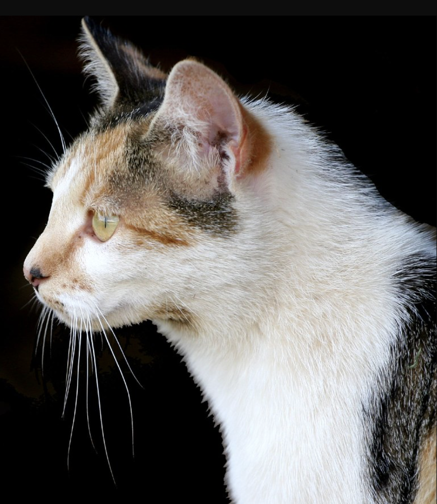

# 3.2 — The Cat Is Too Quiet

[← All graded readers](reader.md){ .graded-reader-back }

{ width="480" style="display:block; margin:1.25rem auto 2rem auto;" }

En limel, wamu i dami en bontame molcui, mai cali falen i anocari de boelori, hay i aparih de molcui.

Cali falen i anivari, a miau i dami en bontame su i anvuum; dantam i vardei e tam jetai.

Falen i iliro ca a miau i nomie no yunitam, eta i widuo su i vardei e ilwol ca miau i vardei.

Notor i siyal e wamu en bontame, widuo de vanpai de miau.

Yasoi, i anefe e wamu en molcui su i nordau e molcui de miau.

Su falen i ilaluan: “Nim i ilian ce run i anidai! Run i anitaum.”

Mai a miau i nomie no varsusum. Dantam i anlaro vardei e wamu.

Show English translation

At night, a fish is in its bowl on the table, but when the child leaves the room, it jumps out from the bowl.

When the child returns, the cat is on the table and is not moving; it is staring at one direction.

The child thinks the cat is acting strangely, so they come closer and look at whatever the cat is watching.

Then they find the fish on the table, close to the cat’s paw.

Quickly, they put the fish in the bowl and move the bowl away from the cat.

And the child says, “I know what you want! You won't take it.”

But the cat doesn't seem to listen. It just keeps looking at the fish.

---

## Try to answer in Oravia

<strong>Cenon falen i siyal e wamu?</strong>

Check answer

<strong>English question:</strong> How does the child find the fish?

<strong>Possible answer:</strong> Hay i vardei e ilwol ca miau i vardei su i siyal e wamu en bontame.

<strong>English:</strong> They look at what the cat is staring at and find the fish on the table.

### What’s the story about?

Try to retell the story in **1–3 sentences in Oravia**. 

[3.1 — The Birds](reader3-01-the-birds.md) · [All graded readers](reader.md) · [3.3 — Too Much Salt](reader3-03-too-much-salt.md)
