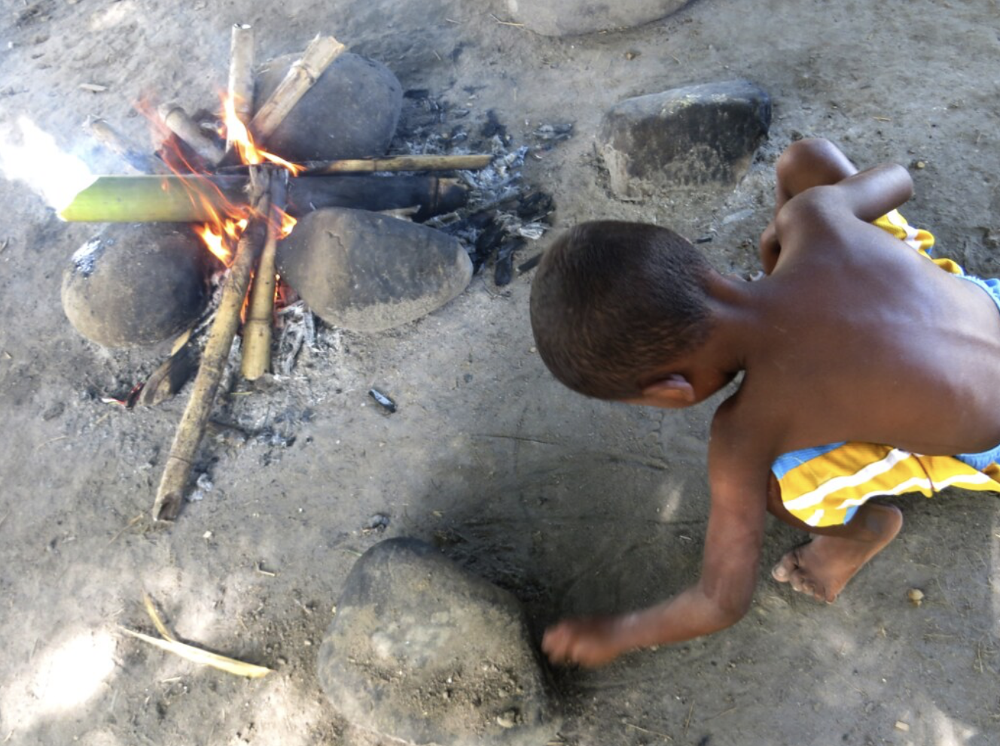

# 3.3 — Too Much Salt

[← All graded readers](reader.md){ .graded-reader-back }

{ width="480" style="display:block; margin:1.25rem auto 2rem auto;" }

Fare i lirul boemo e maemiri, mai litam a yalgai fano i neauta anidai i elomiu.

Eta a falen i neron e noniu masha en maemiri.

Notor, hayas i vil i iloi lilon a maemiri i pohlufu.

Caora noi, a falen i ilonya ca i neronar e masha. Eta i neron lili.

A maemiri a anparu. A fa i bontame su i apafene sora mo. A jor fare i anilie i mo, mai i anepou notam tam vardur.  

Jal fare su i anilie, su i ilaluan: “A maemiri a... yunitam!”

Falen i oila-ilace: “Yuba?”

“Yunitam,” fare i daco, su i asela.

Notor falen i sero ca hay i neronar e masha tor li! Mai a hay a yungi caora elomiu, eta i mo e neloa maemiri.

Show English translation

The parent habitually cooks rice, but today the small child eagerly wants to help.

So the child adds some salt to the rice.

Then, they must wait while the rice boils.

Because of that, the child forgets that they added salt. So they add it again.

The rice is ready. The family puts on the table and sits to eat. The mother tries to eat it, but stops after one bite.

The father too tries, and says, “The rice is… special!”

The child asks happily: “Good?”

“Special,” the parent replies, and smiles.

Then the child remembers that they added salt twice! But they are proud for their help, so they eat all the rice. 

---

## Try to answer in Oravia

<strong>Ceora falen i anona e masha tor li?</strong>

Check answer

<strong>English question:</strong> Why does the child put salt twice?

<strong>Possible answer:</strong> Caora hay i ilonya ca i anonar.

<strong>English:</strong> Because they forget they had added it.

### What’s the story about?

Try to retell the story in **1–3 sentences in Oravia**. 
