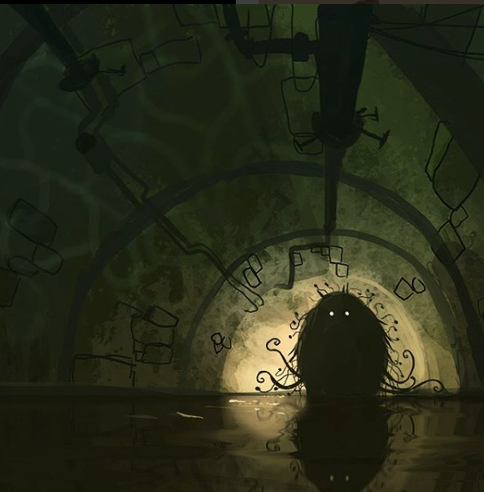

# The Monster in the Tunnel

**Level:** Fluency  
**Topic:** The character is walking in the sewer when they see a monster

---
  
Image by Goro Fujita

<audio controls style="width:100%">
  <source src="audio/hehma.mp3" type="audio/mpeg">
</audio>

## Read

**Hehma en Jobos**

i vanpai en jobos. vanru en wa, nedas yolimel ca nim i anja yahlul yufer borcai no antai. 

tonan, a yaltan hehou. notor nim i vardei. e hehma, ca i anvu jetai nim.

a hehma ca lirular i elemi jenpur nime bonfene. yadetu, nim i siyal e hay.

---

## Tips

a [subject] i [verb] e [obj direct]  
antai = leader, guide  
anja = use  
anvu = move  
borcai = wall  
ca = that (connector)  
elemi = life, live  
hay = he/she/it/they singular  
hehou = shadow  
hehma = monster, beast  
jetai = direction  
jenpur = under  
jobos = tube, pipe, tunnel  
lirul = habit  
lirular = completed habit, used to  
nedas = 10/10 (maximum intensity)  
nim = I, me  
no = like, as  
notor = then, second event  
siyal = find, detect  
tonan = sudden, suddenly  
vanpai = foot, step  
vanru = knee  
vardei = eye, see, look  
wa = water  
yadetu = finish, finally  
yahlul = smooth, soft  
yolimel = dark, black  
yaltan = big, large  
yufer = dirty, filth  

---

[← Back to Readings](readings.md)
