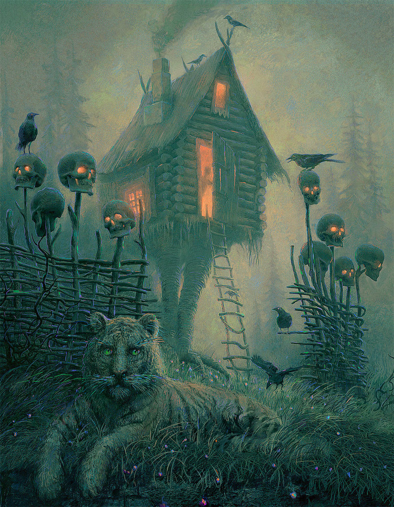

# The Witch House

**Level:** Extension   
**Topic:** The character approaches a witch house  

---

{ width="600" }

## Read  

**Bo de Heivio Haijor**  

i do i vardei en bo e pohcavo luyar. su en nebalem antori bo bortal, e daciu de yamirli heivio haijor. o hay en bo.  

nim i jelano e bo. yedia yaltana miau i bonfene en lea bortal. notam, a miau i anvu e varsus jetai nim. notor, tonan, e varodu. hay i siyal e nim.  

anja yasoi aparih, hay i widuo. noi ilteli, a bo bortal i antori, su o heivio haijor i ilofun-vardei.  

“bi elodanis run i anifi sora i anivari-anita e rune miau, tornono. bi muhsis hay nedas lirul i sioer-copei e bo.”  

---

## Tips  

a [subject] i [verb] e [direct object] u [indirect object, to, for]  
a...a... = is/are (copula)  
-a = indicates a compound, multiple words for one concept
anifi = come  
anivari = back 
anita = take  
antori = open  
anvu = move, go  
aparih = jump, leap  
bi = speaker comment marker   
bo = house 
bonfene = bed, to lie down  
bortal = door  
copei = seek, search, hunt  
daciu = shape  
(da)sora = purpose, for  
elodan = freedom  
en = location (at, in)  
hai = agent, user  
heivio = magic  
hay = he/she/it  
i = verb marker  
-is = prospective
ilofun = hesitant  
ilteli = moment, instant  
jelano = circle, round, around  
jetai = direction, toward  
jor = female, woman  
lea = land   
luyar = light, illumination  
miau = cat  
muhsis = mosquito, fly, annoying  
nebalem = 4/10    
nim = I, me  
pohcavo = fuel  
siyal = detect, notice, find  
tornono = affectionate for fatorno    
tonan = suddenly  
-um = no/not  
vardei = see, look, eye  
varodu = head  
varsus = ear, to hear  
widuo = near, close by  
yamirli = old   
yasoi = fast, quickly  
yedi = stripe    
yaltan = large, big    
  

[← Back to Readings](readings.md)
