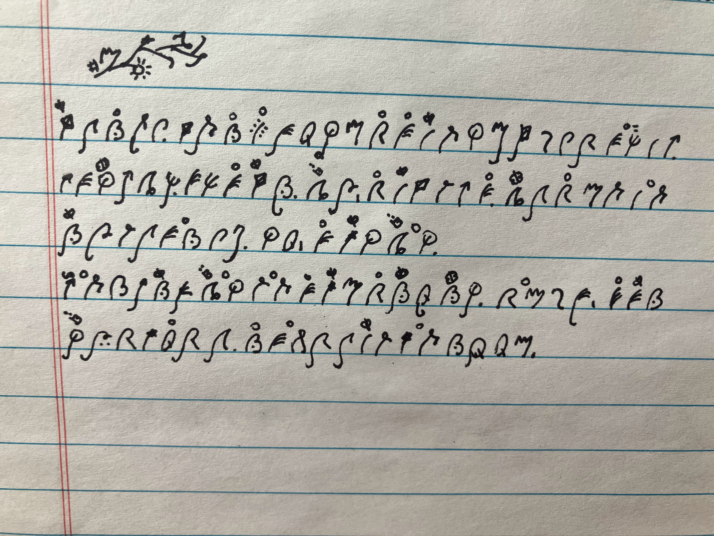
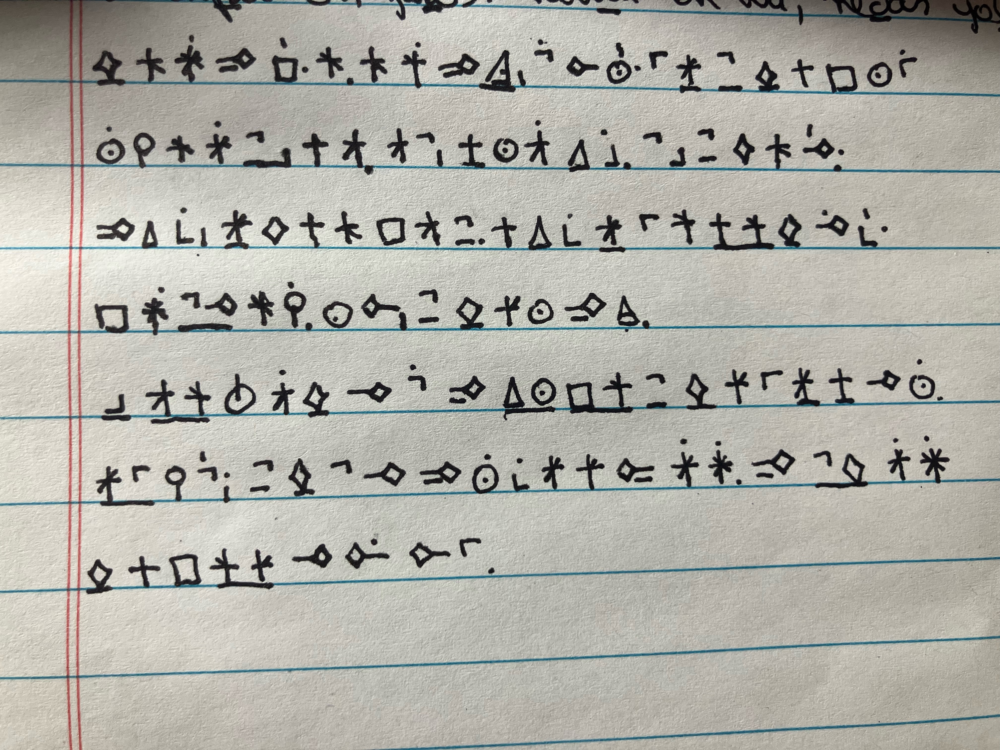

# Script

We are now squarely outside of auxlang territory. Oravia also has scripts for worldbuilding purposes!

All scripts work the same way. They convey **both sound and meaning**, each word is exactly **two symbols long**, and there are **only 21 unique letters**.

*How is that possible?* You may wonder...
Oravia's unique structure makes it possible!

## The structure

Before you proceed, a note: this explanation will make much more sense if you already know some Oravia!

It works like this:  
First symbol -> the domain  
First marker -> the cluster  
Second marker -> the subcluster  
Second symbol -> the sound  

The symbols would be equivalent to letters. The markers on those symbols are equivalent to numbers.    
For example, if we want to say *lunhem*, summer. We would write the equivalent of:

L11H

L is the domain, nature.   
1 is the cluster in that domain, *lu*. The order of clusters are the order they appear in the lessons, so 0 is li, 1 is lu and 2 is le.  
1 is the subcluster within that cluster, *lun*. 0 would be base lu, 1 is lun, *seasons*.  
H is the sound. The last letter gives a sound clue. This works because by the time we narrow down to the subcluster, there are not a lot or word options.  

So, L11H = lunhem

Then the prepositions, pronouns, etc, can be expressed based on domain sound, as in:  

n = nim, r = run, d = de, s = su, etc

And they are accompanied by a marker which indicates they are not a "vocabulary" word.  

## The Official Scripts

There are two official scripts in Oravia. 

### The Garden Script
{ width="400" }

This is used by the government and official communication.

### The Stars Script
{ width="400" }

This is used by astronomers, scholars and sorcerers.

## The Unofficial Scripts

### The Abujida

This is a variation of the star and the garden scripts where the markers indicate vowels instead of cluster and subcluster. Used by traders, fishermen and laborers because it's simpler and more practical. It looks fairly similar to the official scripts, except that it uses more space (many syllables per word instead of just using two symbols), and words may be separated by dots or spaces.

### The Animal Crackers

This kind of script is used by children. The motifs are usually animals, plants and scenery, and that's where the name came from. Each child or group of children create their own, and they are constantly changing. Because of this, there are many variations and adults cannot read it.

Some examples of Animal Crackers Script

{ width="400" }

{ width="400" }

---

[Start Learning Oravia →](../course/lesson00.md){ .md-button .md-button--primary }
